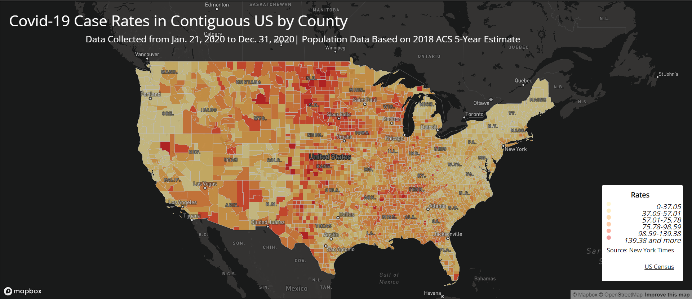
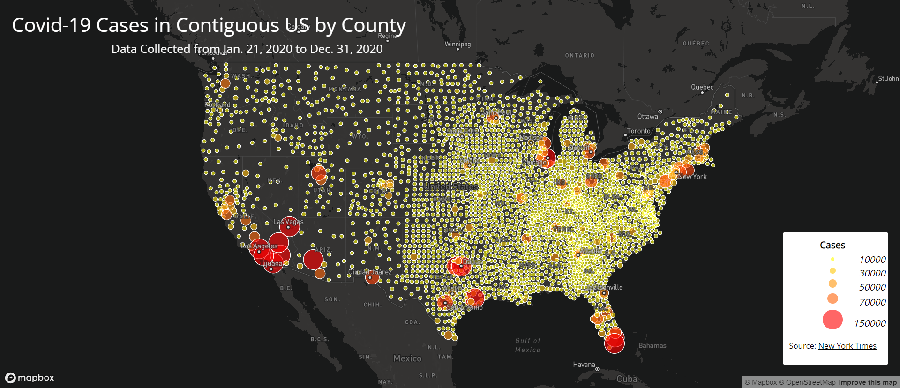

# Lab 3
## Introduction
For lab 3, I used used HTML, CSS, and Javascript to create a proportional sybol map and a choropleth map. The proportional symbols represent the Covid cases in 2020 of specific counties. The colors on the choropleth map represent the rates.

## Map Comparison

Above is the choropleth map of the US Covid rates in 2020

Above is the proportional symbol map of the US Covid cases in 2020

For the map of Georgia, the highest concentration of tweets takes place in Atlanta. This is to be expected because Atlanta is the largest city in Georgia, with a population of 532,695. However, the map of Lousiana sees a more sparse distribution of data points. There are only 3 data points in New Orleans in the 10 minutes I ran the crawler. They represent different geospatial patterns, as Georgia has more people tweeting in the city at night, whereas Lousiana has a more evenly distributed number of tweets from the entire state.

## Word Cloud Comparison

Above is the Word Cloud for tweets from Georgia

Above is the Word Cloud for tweets from Lousiana.

I created Word Clouds of the most frequent words in the tweets I collected. Surprisingly, almost none of the words are related to basketball. This is disappointing because NBA was the entire reason I chose the two locations. Instead, Georgia's most frequent words was originally ðŸ. I removed the option, as I realize it is most likely an emoji. For actual comprehensible words, I was surprised to find the word "Thank" as one of the top words, given how toxic Twitter can be. It is also hilarious that "Down" and "Bad" were two popular words, which makes a lot of sense since Twitter users are almost always "down bad." For Lousiana, the words appear to be all over the place. "CO" is the top result because it is present in every twitter link. I found it interesting that "go," "out," and "tonight" are three strong presence. Maybe this means that citizens of Lousiana are looking for activities for the night. Which makes sense, given I collected the tweets at night. I also find it adorable that the word "love" has a strong presence in both states. To me, the ten minutes of tweets I collected from Georgia possibly have more bots. It appears more sexual than the Lousiana Word Cloud.